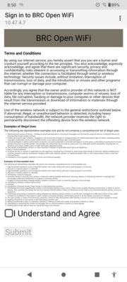
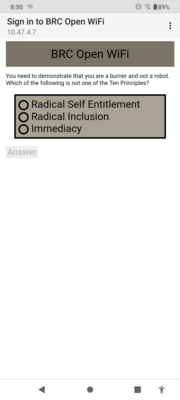
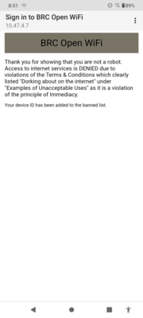
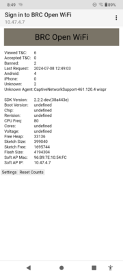
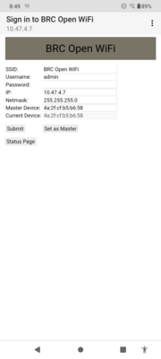

# BlackRockCityFakeWiFi

## Purpose
Create a joke WiFi access point for Black Rock City (aka Burning Man). The person trying to use the access point gets a huge list of Terms and Conditions in ever smaller font. Once they agree, they are run through some questions to "Prove they're not a robot".

Finally they get told that "Dorking around on the Internet" is against the principle of Immediacy and are dumped.

]
]
])

## Development Environment
I developed this on generic ESP8266 and ESP32 boards using the Arduino IDE. It also supports the OLED display on a Heltec WiFi Kit 32 (V3) or WiFi Kit 8. In addition to the OLED the Heltec boards are nice in that they can run off of either USB or a LiPo battery and can charge the battery from USB.

The web pages were created with the [Pulsar](https://pulsar-edit.dev) editor. A small C program is then used to convert the
pages into data stored in the main flash memory. The C program was developed in Visual Studio 2019.

Boards that I have tested on are:

- [Heltec WiFi Kit 32 (V3)](https://heltec.org/project/wifi-kit32-v3/)  
- [Heltec WiFi Kit 8](https://heltec.org/project/wifi-kit-8/)  
- [LOLIN (Wemos) D1 R1](https://www.wemos.cc/en/latest/d1/index.html)  
- [IdeaSpark ESP32](https://www.amazon.com/s?k=ideaspark)

## Captive Portal
The code implements a Captive Portal which operates like the typical free WiFi you'd find at a restaurant.
When the user connects it grabs all traffic from that user regardless of what they asked for and redirects it
to its signon process. I owe a lot to the [Mobile Rick Roll](https://github.com/idolpx/mobile-rr) project for their work in figuring out how to
implement this.

## Building the project
I'm using the Arduino 2.3.2 IDE.

- After installing the IDE go to the preferences (Control-Comma) and add these Additional Board Manager URLs.

- https://arduino.esp8266.com/stable/package_esp8266com_index.json  
- https://espressif.github.io/arduino-esp32/package_esp32_index.json
- https://github.com/Heltec-Aaron-Lee/WiFi_Kit_series/releases/download/3.0.0/package_heltec_esp32_index.json

- Exit and restart the IDE.

- In the Boards Manager (left column, second icon from the top) and install
    - "esp32 by Espressif Systems" version 3.0.1
    - "Arduino ESP32 Boards" version 2.0.13
    - "ESP8266 Boards" version 3.1.2

- Now go to the Library Manager (left column, third icon from the top) and install
    - ArduionJson by Benoit Blanchon. 7.0.4
    - ESP Async WebServer by me-no-dev 3.0.6
    - AsyncTCP by me-no-dev 3.1.4
    - ESPAsyncTCP by dvarrel 1.2.4
    - U8g2 by oliver. 2.34.22 - If using one of the boards with an OLED display.

- Plug your ESP board into a USB port.

- Click on the drop down in the button bar. Select your board and COM port.

- Lastly click on the Upload (right arrow) button to compile and install the software.

## Accessing the Status and Configuration Pages
- Bring up the list of access points and find BRC Open WiFi.
- Select that and you should be redirected to the giant page of legalese.
- Find the sentence "The following are representative examples only and do not comprise a comprehensive list of illegal</a> uses:"
- Click on the word "illegal".
- Log in with the default credentials of admin/changeme (both are all lower case).

]
]

## Configuration Options
- SSID - Name of the Access Point that shows up on your phone.
- Username - Username for accessing the statistics and settings.
- Password - Password for same. If left blank the previous password will remain in effect.
- IP Address - The IP Address for the Access Point. Note: Changing this affects the address used to access the configuration page.
- Netmask - The Netmask for the Access Point. You almost certainly should not change this.
- Master Device - The MAC address of a master device (aka your phone) that will be automatically logged in and sent to the status page.
- Current Device - The MAC address of the device you're currently using. Displayed so you can copy it into the Master Device if you want.

Changing the settings will cause the ESP to reboot.

# Modifying the HTML pages

The html directory contains all of the HTML, CSS, JavaScript, etc. It has to be converted into
a cpp file with strings. This can be done with the HtmlHelper program. You have to build the HtmlHelper with Visual Studio, or some other C compiler. Then run it as follows to put it into a C file

> HtmlHelper.exe --output=webpages.cpp --include=BMWiFi.h blocked.html brc.css checkbox.css legal.html question.html questions.js questions.json debugdata.js radio2.css banned.html banned.js redirect.html status.html status.js bmwifi.js settings.html settings.js login.html

Move the resulting webpages.cpp file over to the BMWiFi directory.
> move *.cpp ..\BMWiFi
